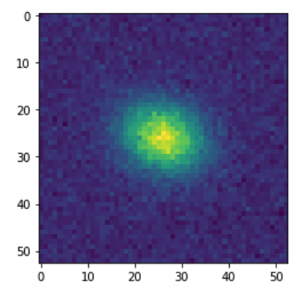

# Simulate a simple galaxy with galcheat and GalSim

In this tutorial, we will see how we can use the survey parameters in galcheat
to create a simple elliptical galaxy with galsim. The galaxy will be convolved with
a optical+atmospheric component PSF, include background and noise, and use
the r-band filter of the LSST survey.

Please note that `galsim` is not a `galcheat` dependency, so it must be installed
separately to follow this guide. See [here](https://galsim-developers.github.io/GalSim/_build/html/install.html)
for `galsim` installation instructions.

To draw the image at the end of the tutorial, `matplotlib` will also need to be installed separately.

First, we import galsim and necessary functions from galcheat.

```python
import galsim
import galcheat
from galcheat import get_survey
from galcheat import utilities
import matplotlib.pyplot as plt
import numpy as np
```

Then, we specify the survey and filter from galcheat we will use. Along with
galaxy parameters.

```python
# galcheat survey and filter.
LSST = get_survey("LSST")
r_band = LSST.get_filter("r")

# galaxy model parameters
mag = 22.0 # ab
e1 = 0.2
e2 = 0.2
hlr = 1.2 # arcsecs
```

Now we create a galaxy model and shear it.

```python
# get flux from magnitude using galcheat for LSST r-band.
total_flux = mag2counts(mag, LSST, r_band)

# get only the value of flux in desired units.
total_flux = total_flux.to_value('electron')

# simple gaussian galaxy with ellipticity
gal = galsim.Gaussian(flux=total_flux, half_light_radius=hlr)
gal = gal.shear(e1=e1, e2=e2)
```

Now we create a PSF, first the atmospheric component.

```python
fwhm = r_band.psf_fwhm.to_value("arcsec")
atmospheric_psf_model = galsim.Kolmogorov(fwhm=fwhm)
```

Then, the optical component.

```python
effective_wavelength = r_band.effective_wavelength.to_value("angstrom")
obscuration = LSST.obscuration.value
mirror_diameter = LSST.mirror_diameter.to_value("m")
lam_over_diam = 3600 * np.degrees(1e-10 * effective_wavelength / mirror_diameter)
optical_psf_model = galsim.Airy(lam_over_diam=lam_over_diam, obscuration=obscuration)
```

The full PSF is the convolution of both components.

```python
psf = galsim.Convolve(atmospheric_psf_model, optical_psf_model)
```

We convolve it with the galaxy model

```python
conv_gal = galsim.Convolve(gal, psf)
```

Finally, we add noise and background:

```python
# retrieve the sky level using galcheat.
sky_level = utilities.mean_sky_level(LSST, r_band).to_value('electron')

# add noise and background to image.
pixel_scale = LSST.pixel_scale.to_value('arcsec')
generator = galsim.random.BaseDeviate(seed=0)
noise = galsim.PoissonNoise(rng=generator, sky_level=sky_level)
image = conv_gal.drawImage(nx=53, ny=53, scale=pixel_scale)
image.addNoise(noise)
```

Now `image.array` can be plotted to see the galaxy that was produced.

```python
plt.imshow(image.array)
```

We get the following image:


